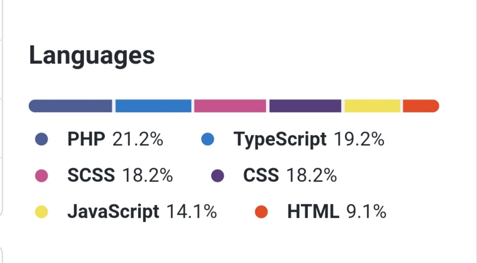
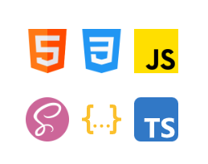

<h1 align="center">ℍ𝕚 🌹 𝕀'𝕒𝕞 𝕄💖𝕕𝕒𝕤𝕤𝕚𝕣</h1>
<!-- <h2>Connecting ⋆ to ⋆ Github &nbsp;&nbsp;<a href="">✉️ Mail</a> &nbsp;&nbsp;<a href="">🌏 mcodexpro</a></h2>             -->

<h2 align="left">My Github Organizations</h2>
<ul align="left">
  <li>Plugins JS, PHP, Css, Javascript <a href="https://github.com/mdrplugins">https://github.com/mdrplugins</a></li>
  <li>Javascript libraries: <a href="https://github.com/Js-Libraries">https://github.com/Js-Libraries</a></li>
  <li>PHP libraries: <a href="https://github.com/phpLibraries">https://github.com/phpLibraries</a></li>
  <li>Web projects: <a href="https://github.com/websprojects">https://github.com/websprojects</a></li>
</ul>

<h2 align="left">Popular languages</h2>

<ul align="left">
  <li>Plugins JS, PHP, Css, Javascript <a href="https://github.com/mdrplugins">https://github.com/mdrplugins</a></li>
  <li>Javascript libraries: <a href="https://github.com/Js-Libraries">https://github.com/Js-Libraries</a></li>
  <li>PHP libraries: <a href="https://github.com/phpLibraries">https://github.com/phpLibraries</a></li>
  <li>Web projects: <a href="https://github.com/websprojects">https://github.com/websprojects</a></li>
</ul>

<h2 align="left">Most used languages</h2>

